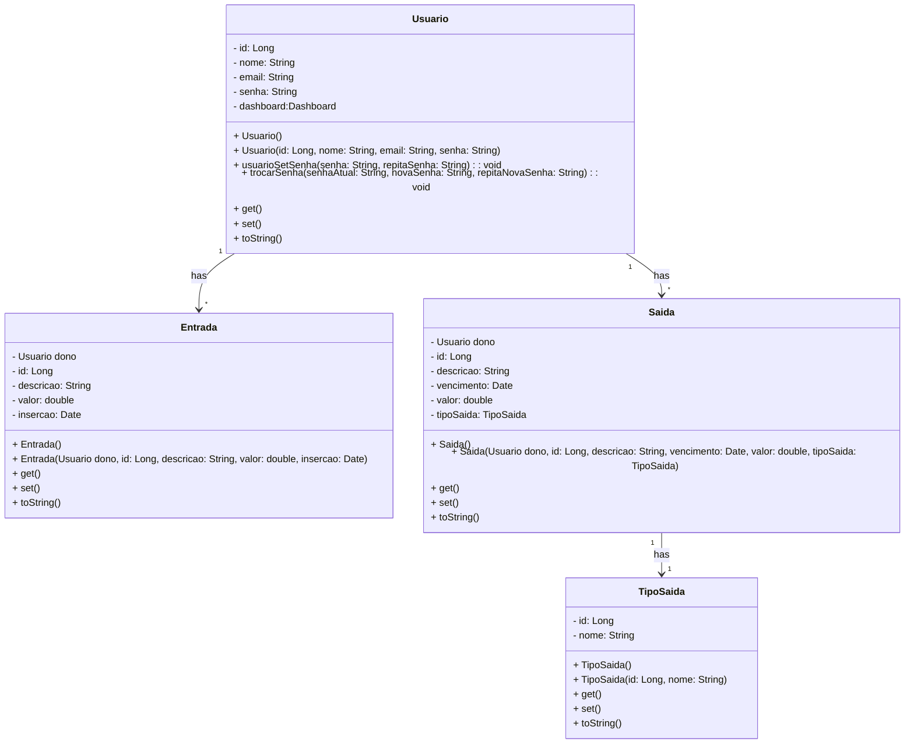

```mermaid
classDiagram

    class Usuario {
        - id: Long
        - nome: String
        - email: String
        - senha: String
        - dashboard:Dashboard
        + Usuario()
        + Usuario(id: Long, nome: String, email: String, senha: String)
        + usuarioSetSenha(senha: String, repitaSenha: String): void
        + trocarSenha(senhaAtual: String, novaSenha: String, repitaNovaSenha: String): void
        + get()
        + set()
        + toString()
    }
    
    class Entrada {
        - Usuario dono
        - id: Long
        - descricao: String
        - valor: double
        - insercao: Date
        + Entrada()
        + Entrada(Usuario dono, id: Long, descricao: String, valor: double, insercao: Date)
        + get()
        + set()
        + toString()
    }

    class Saida {
        - Usuario dono
        - id: Long
        - descricao: String
        - vencimento: Date
        - valor: double
        - tipoSaida: TipoSaida
        + Saida()
        + Saida(Usuario dono, id: Long, descricao: String, vencimento: Date, valor: double, tipoSaida: TipoSaida)
        + get()
        + set()
        + toString()
    }

    class TipoSaida {
        - id: Long
        - nome: String
        + TipoSaida()
        + TipoSaida(id: Long, nome: String)
        + get()
        + set()
        + toString()
    }

    Saida "1" --> "1" TipoSaida : has
    Usuario "1" --> "*" Entrada : has
    Usuario "1" --> "*" Saida : has
```
